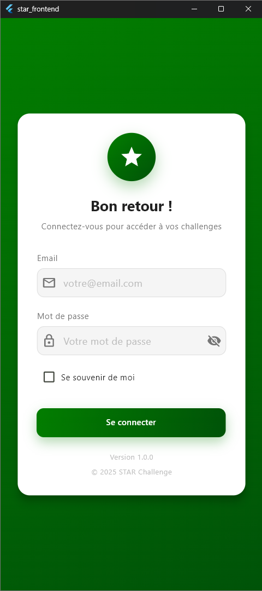
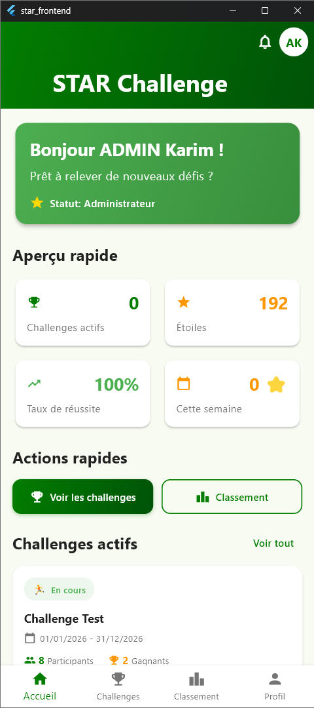
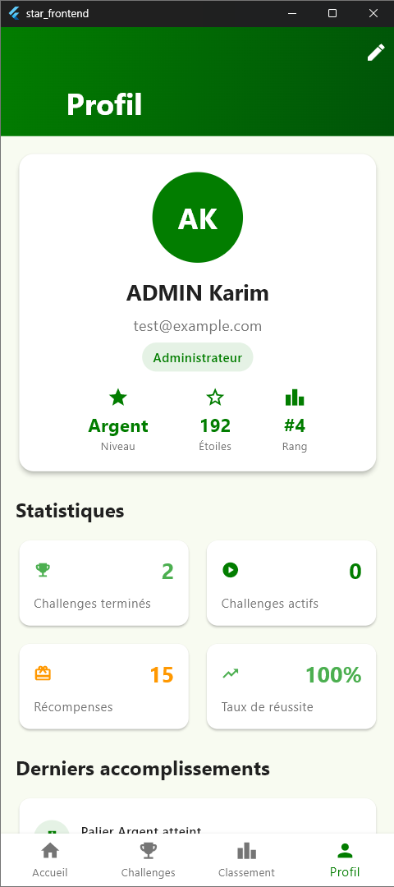
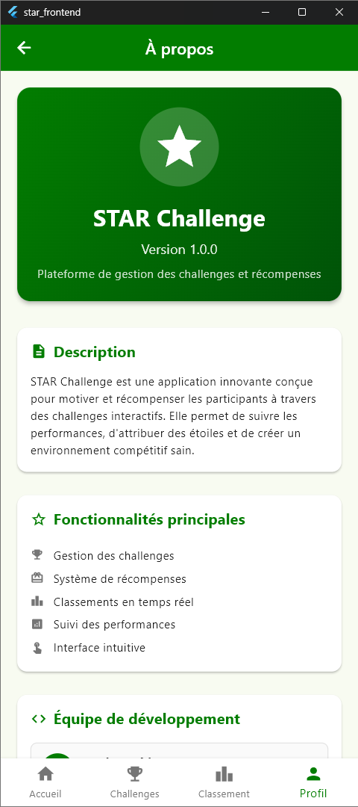

<div align="center">
  

  <h1>STAR Challenge – Frontend Flutter</h1>

  <p>
	Application mobile moderne de gamification et de challenges, conçue avec Flutter (Material 3), un routage robuste, une architecture modulaire et une UX soignée.
  </p>

  <p>
	
	
	
	
	
	
  </p>
</div>

## Aperçu rapide

STAR Challenge est une application front mobile permettant aux utilisateurs de participer à des challenges, suivre leurs performances et se positionner dans un classement dynamique. Elle implémente un thème cohérent, des animations fluides et un socle technique solide (navigation, état, services, configuration environnement).

Points clés:
- Material 3 avec thème personnalisé, dégradés et composants cohérents.
- Routage déclaratif avec `go_router` (splash, login, home, challenges, classement, profil…).
- Gestion d’état via `Provider` (prévu pour Riverpod si nécessaire).
- Services applicatifs (API, stockage local), configuration multi‑environnements.
- Composants UI réutilisables, validations, animations et feedback soignés.

---

## Démo visuelle

<table>
	<tr>
		<td align="center"><strong>Connexion</strong></td>
		<td align="center"><strong>Accueil</strong></td>
	</tr>
	<tr>
		<td></td>
		<td></td>
	</tr>
	<tr>
		<td align="center"><strong>Profil</strong></td>
		<td align="center"><strong>À propos</strong></td>
	</tr>
	<tr>
		<td></td>
		<td></td>
	</tr>
	<tr>
		<td colspan="2" align="center"><em>Les captures sont stockées dans <code>assets/demo/</code> pour un accès simple depuis le README.</em></td>
	</tr>
	</table>

---

## Fonctionnalités

- Authentification et redirections guardées (Splash → Login → Home).
- Tableau de bord avec statistiques, actions rapides, activités récentes.
- Liste des challenges, détails et participations utilisateur.
- Classement (leaderboard) dynamique.
- Profil complet, édition, section À propos et confidentialité.
- UX moderne: thèmes, dégradés, animations, feedback visuels, composants custom (boutons, champs…).
- Intégration API (Dio/HTTP), stockage local (`shared_preferences`), logs, formats (`intl`).

---

## Architecture et organisation

Architecture modulaire, claire et testable:

```
lib/
	core/
		config/         # AppConfig, gestion des environnements et feature flags
		constants/      # Couleurs, chaînes, constantes (endpoints, tailles…)
		navigation/     # go_router, routes, shell, redirections
		utils/          # Helpers, logger…
	data/
		models/         # Modèles métier
		services/       # ApiService, StorageService…
	presentation/
		providers/      # AuthProvider, UserStatsProvider, Leaderboard, Challenge
		screens/        # UI: auth, home, challenges, leaderboard, profile, splash
		widgets/        # Composants réutilisables (boutons, cards, inputs…)
	main.dart         # Bootstrapping, thème Material 3, providers, router
assets/
	logo.png          # Identité visuelle
	logo-dark.svg     # Variante foncée
	logo-light.svg    # Variante claire
	demo/             # Captures d’écran utilisées par le README
```

Routage principal (`go_router`):
- `/splash` → initialisation/boot
- `/login` → authentification
- `/home` → tableau de bord
- `/challenges` (+ détails, participations)
- `/leaderboard`
- `/profile` (+ édition, à propos, confidentialité)

---

## Pile technologique (Tech stack)

- Flutter (Material 3), Dart 3.8+
- Navigation: `go_router`
- État: `provider` (et `flutter_riverpod`/`riverpod` disponibles)
- Réseau: `dio`, `http`, `socket_io_client`
- Stockage: `shared_preferences`
- UI/UX: `flutter_svg`, `cached_network_image`, `shimmer`, `lottie`
- Sérialisation: `json_annotation` + `json_serializable` (via `build_runner`)
- Outils: `intl`, `uuid`, `logger`, `flutter_lints`

---

## Dépôts GitHub

- Admin Dashboard: [github.com/fekikarim/starChallenge_dashboard](https://github.com/fekikarim/starChallenge_dashboard)
- Backend API: [github.com/fekikarim/starChallenge_backend](https://github.com/fekikarim/starChallenge_backend)

---

## Démarrage rapide

Prérequis:
- Flutter SDK récent (canal stable)
- Dart ≥ 3.8 (cf. `pubspec.yaml`)

Étapes:
1) Installer les dépendances
2) Lancer l’application

Commandes (PowerShell):

```powershell
flutter pub get
flutter run
```

Build de production (exemples):

```powershell
# Android (APK)
flutter build apk --release

# iOS (depuis macOS)
flutter build ipa --release

# Web
flutter build web --release
```

---

## Configuration & environnements

La configuration est centralisée dans `core/config/app_config.dart` et `core/constants/app_constants.dart`.

- Environnements supportés: `development` (défaut), `staging`, `production`.
- Changer l’environnement à l’exécution via `--dart-define`:

```powershell
flutter run --dart-define=ENVIRONMENT=staging
```

`AppConfig` ajuste automatiquement l’URL d’API, la journalisation, l’analytics et d’autres options.

---

## Qualité, lint & tests

- Lints: `flutter_lints` (voir `analysis_options.yaml`).
- Analyse statique:

```powershell
flutter analyze
```

- Tests (si présents dans `test/`):

```powershell
flutter test
```

---

## Bonnes pratiques adoptées

- Séparation claire des responsabilités (core/data/presentation).
- Routage typé et redirections sécurisées selon l’état d’authentification.
- Thème unifié, composants réutilisables et animations non-intrusives.
- Services isolés (API/stockage), logs centralisés, constantes typées.
- Extensibilité prévue (migration/usage Riverpod, internationalisation `intl`).

---

## Gestion des assets de démo

Les captures d’écran sont regroupées dans `assets/demo/` et référencées directement par le README pour éviter tout impact sur l’exécutable. Cette organisation garantit:
- une séparation nette entre assets applicatifs (logos, icônes) et assets de documentation (démo),
- des chemins stables et courts pour les liens du README,
- aucune dépendance côté code (les captures ne sont pas chargées par l’app).

Si besoin d’alléger le dépôt, envisagez de déplacer ces images vers `docs/screenshots/` ou un hébergement externe, puis de mettre à jour les liens du README.

---

## Contribution

1. Créez une branche à partir de `main`.
2. Respectez les lints et la structure existante.
3. Ajoutez des tests si vous modifiez du comportement public.
4. Ouvrez une Pull Request descriptive avec captures si nécessaire.

---

## Licence

Ce projet est distribué sous une licence d’utilisation professionnelle propriétaire. Consultez le fichier `LICENSE` à la racine pour les termes complets.

Résumé des termes principaux :

- Usage interne, non transférable et révocable.
- Modifications autorisées pour des besoins internes.
- Redistribution, sous‑licence, revente et publication publiques interdites sans accord écrit préalable.
- Composants tiers soumis à leurs licences propres.
- Aucune garantie ; responsabilité limitée.

---

## Contact

Pour toute question ou suggestion, merci d’ouvrir une issue ou de contacter :

- Karim — email : [feki.karim28@gmail.com](mailto:feki.karim28@gmail.com) • LinkedIn : [linkedin.com/in/karimfeki](https://www.linkedin.com/in/karimfeki)
- Nesrine — email : [nesrine.derouiche15@gmail.com](mailto:nesrine.derouiche15@gmail.com) • LinkedIn : [linkedin.com/in/nesrine-derouiche](https://www.linkedin.com/in/nesrine-derouiche)

—

Mots‑clés: Flutter, Dart, Material 3, go_router, Provider, Riverpod, Dio, HTTP, Socket.IO, JSON, build_runner, json_serializable, shared_preferences, UI/UX, animations, leaderboard, challenges, gamification, mobile, Android, iOS, Web.
